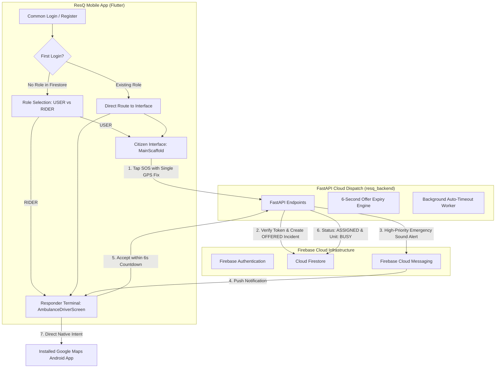

# ResQ (RapidSQ) — Emergency Dispatch & Response System

ResQ is an end-to-end emergency response and dispatch platform engineered with a **single Flutter Android application** serving both Citizens (`USER`) and Responders (`RIDER`), coordinated via a **FastAPI backend**, **Firebase Authentication**, **Cloud Firestore**, and high-priority **Firebase Cloud Messaging (FCM)**.

---

## System Architecture



---

## Core Features

1. **One Common Android App**:
   - Single application codebase powers both citizens and emergency responders.
   - Common authentication interface (`/auth`).
   - First login asks the user to select their role (`USER` or `RIDER`) **exactly once** and persists it to `users/{uid}.role`.
   - Existing users automatically bypass role selection directly into their respective interface.

2. **Single Responder Architecture (`ambulances/main`)**:
   - Designed for real-world emergency demonstration without simulated or fake ambulance data.
   - Authenticated responder UID and real hardware FCM token are linked to `ambulances/main`.
   - No fake maps, random coordinates, or in-app simulated vehicle movement in Firebase mode.

3. **User SOS & Single Fixed GPS Fix**:
   - Single GPS coordinate captured once via device hardware GPS (`geolocator`) when SOS is tapped.
   - No continuous background tracking or location polling after SOS.

4. **Multi-Service Emergency Support**:
   - **Ambulance**: Medical emergency dispatch.
   - **Women Safety**: Personal safety and danger alert patrol.
   - **Fire Brigade**: Fire suppression and rescue squad.

5. **6-Second Emergency Acceptance Window**:
   - Server-enforced 6-second acceptance timer (`offerExpiresAt = server_time + 6s`).
   - Rider terminal rings emergency alert pulses and displays a live 6-second countdown (`6 → 5 → 4 → 3 → 2 → 1`).
   - Accept within 6s $\rightarrow$ incident transitions to `ASSIGNED` and ambulance to `BUSY`.
   - Accept after 6s $\rightarrow$ rejected with `HTTP 409 Conflict`.
   - Rejection or timeout $\rightarrow$ transitions to `WAITING_FOR_RESPONDER` and ambulance is released back to `AVAILABLE`.

6. **Direct Google Maps Android Navigation**:
   - Tapping **Open Google Maps** opens the installed Google Maps Android application directly via native navigation intent (`google.navigation:q=$lat,$lng&mode=d`).
   - Patient SOS coordinates are pre-filled as the destination without manual coordinate entry or in-app WebViews.

---

## Repository Structure

```text
rapidsq/
├── resq_app/                    # Flutter Android Application
│   ├── lib/
│   │   ├── models/             # Data models (EmergencyRequest, AmbulanceUnit, etc.)
│   │   ├── navigation/         # Named routes and navigation graphs
│   │   ├── screens/            # UI Screens (Role Selection, Driver Terminal, Citizen Home)
│   │   ├── services/           # Firebase Auth, Firestore, FCM, Location, Backend API
│   │   ├── state/              # AppStateController with reactive ChangeNotifier
│   │   └── theme/              # Official design tokens and typography
│   ├── android/                # Android native project with navigation intent queries
│   └── test/                   # Comprehensive widget and unit tests (29 tests)
│
├── resq_backend/                # FastAPI Emergency Dispatch Server
│   ├── app/
│   │   ├── routes/             # API routes (Incidents, Ambulances, Devices)
│   │   ├── services/           # DispatchService, NotificationService
│   │   ├── models/             # Pydantic schemas (IncidentRequest, IncidentResponse)
│   │   ├── auth.py             # Firebase ID Token verification
│   │   ├── firebase.py         # Firebase Admin SDK & High-priority FCM messaging
│   │   └── main.py             # FastAPI application entrypoint
│   ├── tests/                  # Pytest integration tests (13 tests)
│   ├── Procfile                # Render web service deployment configuration
│   └── requirements.txt        # Python dependencies
│
└── .gitignore                   # Excludes all secrets, .env, and build artifacts
```

---

## Local Development & Testing

### 1. Running the FastAPI Backend
```bash
cd resq_backend
pip install -r requirements.txt
uvicorn app.main:app --host 0.0.0.0 --port 8000 --reload
```

Run backend test suite:
```bash
python -m pytest tests/test_api.py -v
```

### 2. Running the Flutter App
```bash
cd resq_app
flutter pub get
flutter run --dart-define=APP_MODE=firebase
```

Run Flutter test suite & analyzer:
```bash
flutter analyze
flutter test
```

---

## Security & Secrets Policy
* No API keys, passwords, private keys, `.env` files, or Firebase service account keys are stored in this repository.
* All sensitive credentials are configured via environment variables and local gitignored files.
